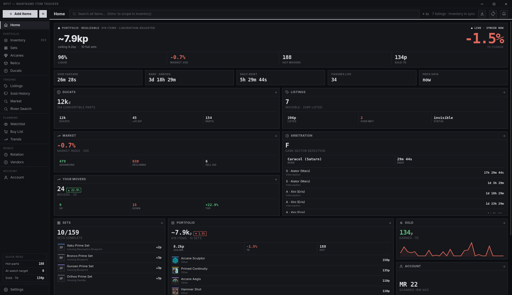
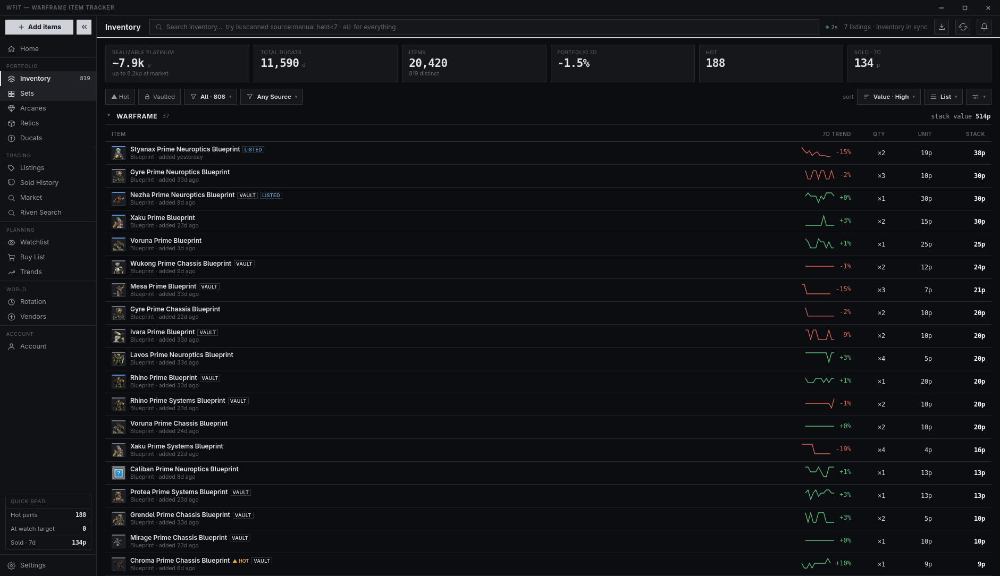
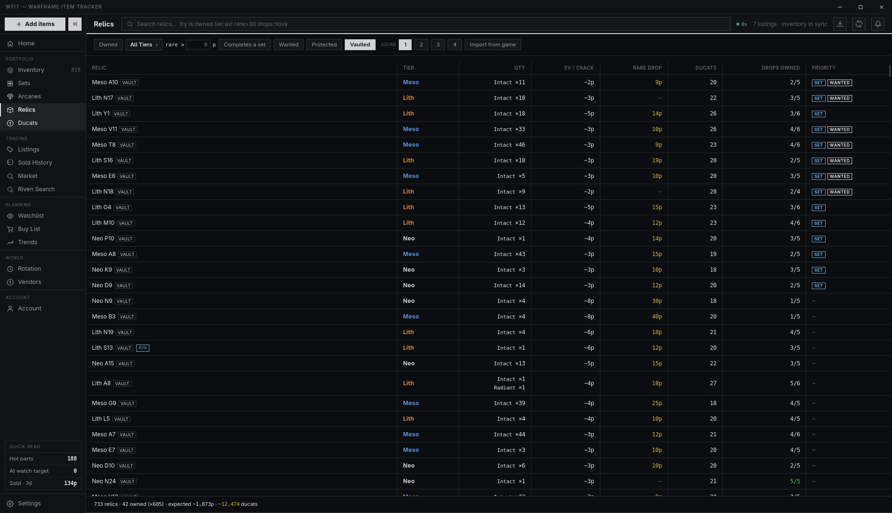
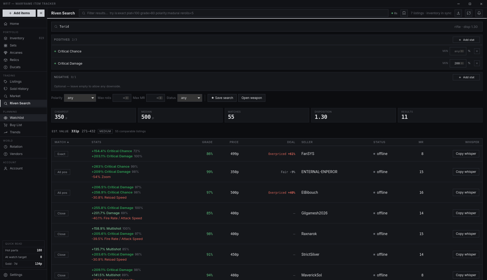
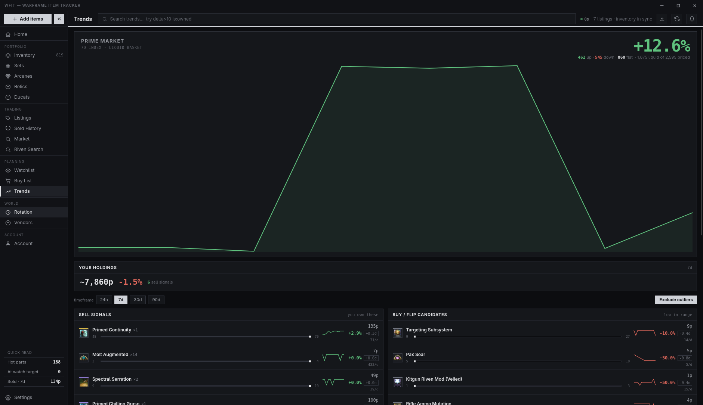
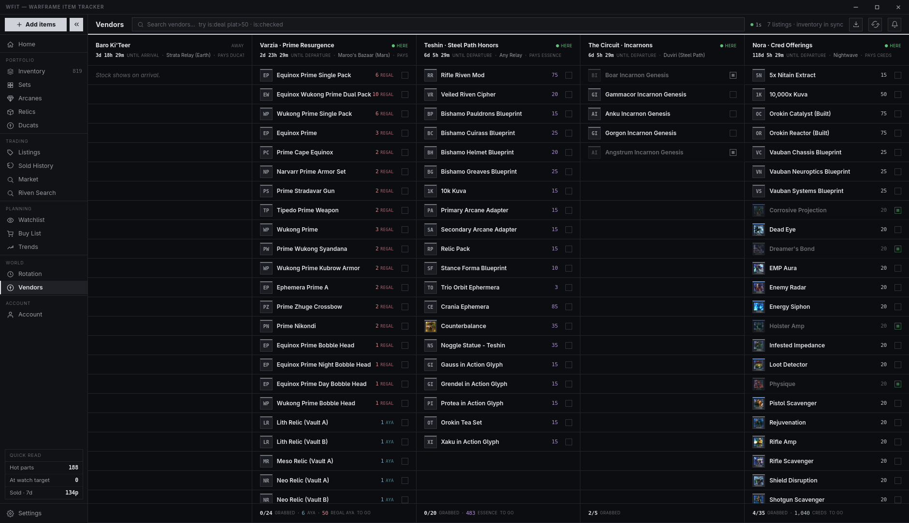
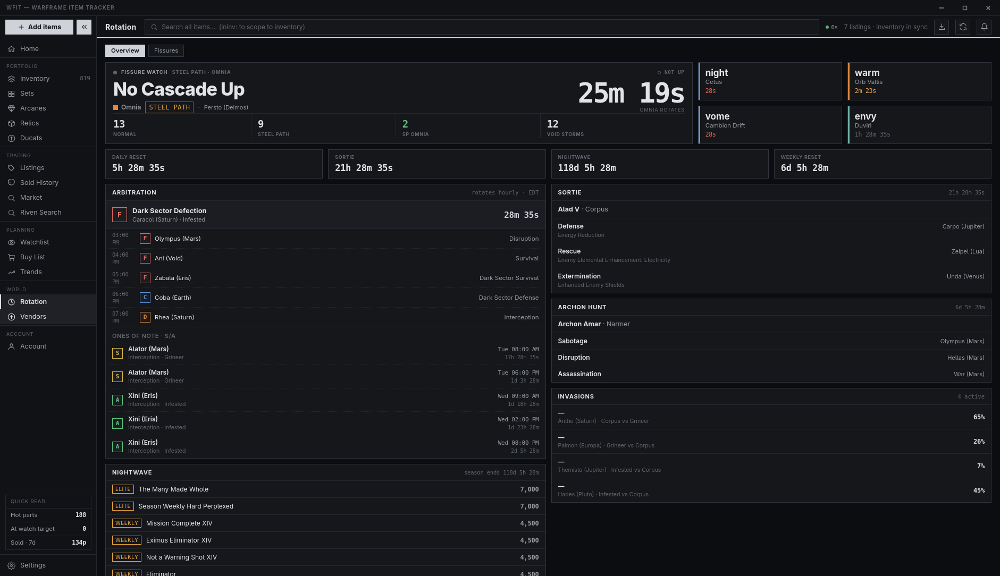
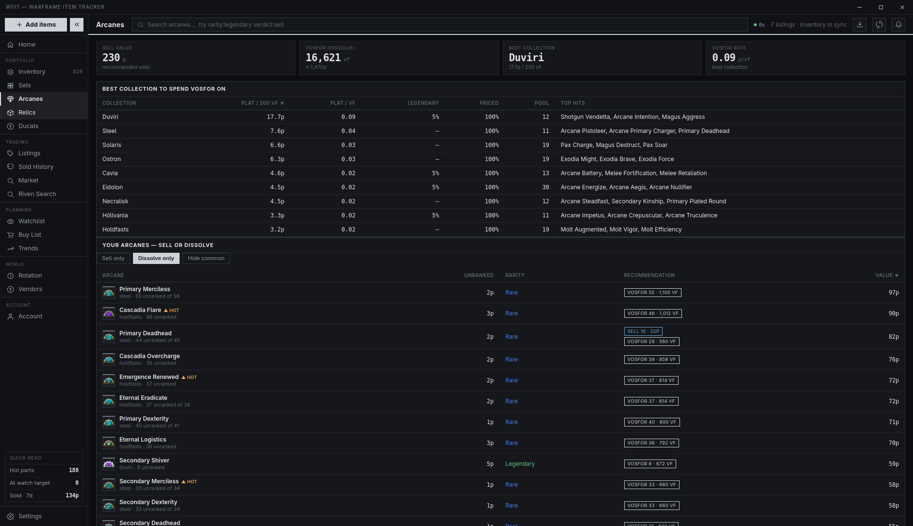

# WFIT — Warframe Item Tracker

A single-user **desktop app** for tracking your owned Warframe tradeable items, with live
[warframe.market](https://warframe.market) prices, trends, set completion, ducat-conversion
efficiency, a buy watchlist, sales history, your market sell orders, arcane dissolution math, and
live world-state (fissures / cycles / vendors / arbitrations).

It's a local-first rewrite of an old React + Supabase webapp — the entire cloud backend is gone in
favor of **one binary + one local SQLite file**. No auth, no hosting, no deploy.

- **Stack:** Tauri 2 (Rust core) · SQLite (rusqlite, WAL) · React + Vite + TypeScript · TanStack Query
- **Platform:** Linux + Windows (installers below); macOS must be built from source on macOS.
- **Design:** dense, square, monochrome "trading terminal" aesthetic — hairline borders, tabular
  mono numbers, semantic-only color (`docs/ROTATION_PAGE_DESIGN.md` documents the visual language).



<details>
<summary><b>More screenshots</b> — inventory, relics, rivens, trends, vendors, rotation, arcanes</summary>
<br>

| | |
|---|---|
| **Inventory** — realizable (liquidation-adjusted) portfolio value  | **Relics** — full-catalog browser, squad-size EV, burn order  |
| **Riven Search** — auction screener + value estimator  | **Trends** — market index + your holdings' movers  |
| **Vendors** — Baro/Varzia/Teshin/Circuit/Nora check-off board  | **Rotation** — world state, fissures, arbitrations, Nightwave  |
| **Arcanes** — Vosfor dissolution EV  | |

</details>

---

## Download

> WFIT is a one-person hobby project that has been daily-driven on Linux for a while, but you're
> an early adopter — expect rough edges and please [open an issue](../../issues) when you hit one.
> Your data lives in one local SQLite file (see [Layout](#layout)); nothing is uploaded anywhere.

Grab the latest installer from **[Releases](../../releases/latest)**:

| OS | File | Notes |
|---|---|---|
| **Windows** | `WFIT_x.y.z_x64-setup.exe` (or the `.msi`) | Unsigned for now — SmartScreen will warn; click **More info → Run anyway**. |
| **Linux (any distro)** | `WFIT_x.y.z_amd64.AppImage` | `chmod +x` and run. Needs `webkit2gtk-4.1` installed. |
| **Debian / Ubuntu** | `WFIT_x.y.z_amd64.deb` | `sudo apt install ./WFIT_*.deb` |
| **Fedora / RHEL** | `WFIT-x.y.z-1.x86_64.rpm` | `sudo dnf install ./WFIT-*.rpm` |
| **Arch** | AppImage, or build from source | `scripts/install.sh` builds + installs a native binary. |
| **macOS** | build from source | No prebuilt bundle; `npm run tauri build` on a Mac. |

First launch: the app builds its local item catalog from warframe.market and starts pricing it in
the background (rate-limited to ~2.5 req/s — the full catalog takes a while; the topbar badge shows
data age). Everything works offline afterwards except live prices and world-state.

**Updates:** from v1.2.0 on, Windows installs and Linux AppImages **update themselves** — a daily
check posts an in-app notification and Settings › About gets an **Install** button (signed +
verified; nothing installs without you). deb/rpm installs get the notification with a link here
instead. v1.1.0 predates the updater — reinstall once from the table above.

> ⚠️ **One feature deserves a special warning:** the opt-in [game inventory
> import](#game-inventory-import-opt-in-beta) reads the running Warframe client's memory, which
> **violates DE's Terms of Service and could get your account banned**. It is off by default,
> gated behind a typed consent phrase, and completely separate from the rest of the app — everything
> else only talks to public APIs.

---

## Data sources

| Source | What it feeds | Notes |
|---|---|---|
| **warframe.market v2/v1 API** | catalog, prices, ducats, sets, order books, your listings | The sole source for item/price data. Global **400 ms throttle** (~2.5 req/s) across every call. |
| **DE raw worldstate** (`api.warframe.com/cdn/worldState.php`) | fissures (authoritative), Cetus cycle anchor | Minimally parsed; decoded via bundled WFCD node/mission maps. |
| **Locally derived clocks** (`worldstate/cycles.rs`) | Cetus / Vallis / Cambion / Duviri cycles | Deterministic math — see [World cycles](#world-cycles) below. |
| **api.warframestat.us** | sortie, archon hunt, Steel Path, Baro, Varzia; fissure/cycle fallback | Its origin can lag hours; WFIT only warns when that actually matters. |
| **browse.wf** (`arbys.txt` + Arbitration Goons tiers) | arbitration schedule + S–F node grades | Schedule is precomputed months ahead; downloaded twice a day. |
| **Bundled datasets** (`.tsv` compiled into the binary) | mod rarities, arcane dissolution values, sol nodes, arbitration tiers | No network needed; no DB tables. |

Everything except your inventory / sales / watchlist / buy-list is a **rebuildable cache** — wipe it
and it re-syncs.

---

## Screens

### Inventory
The home screen — every owned item as a dense tile grid (DIM-style), grouped by category
(Warframes, Weapons, Sets, Mods, Arcanes).

- **Tiles** show a thumbnail/monogram, value-tier colored top edge, stack quantity, 7-day trend
  sliver, vault lock, and the per-unit price bar. Hovering magnifies the pointed tile.
- **Views:** grid (3 tile sizes), chips (wide cards), or list (sortable table) — plus label-density
  modes that quiet cheap tiles until hovered.
- **Stat band:** Realizable value (the honest headline), Market value (the `× qty` ceiling), Total
  Ducats, Items (+ distinct count), and more.
- **"What's driving your value"** — a collapsible composition panel ranking your top holdings by
  share of total value.
- **Filters:** search, ▲ Hot (trending up), Vaulted, category, sort, hide-excluded.
- Click any tile → the **drawer**: price + confidence, candlestick chart (MA7/MA30, volume),
  rank-by-rank breakdown for mods/arcanes, bid ladder, and actions (sell, adjust qty, watch…).

### Sets
Prime-set completion: per-set progress bar, part chips (owned ✓ / missing-dashed; click to toggle),
the cost to **finish the set** at live prices, and set-vs-parts value so you know whether to sell
the assembled set or the pieces.

### Trends
A market read over the **liquid subset** of the catalog (items that actually trade), with an
optional outlier filter that winsorizes each item's daily series first — one troll listing a common
mod at 50 000p can't pollute anything.

- **Market index:** equal-weight basket trajectory over the selected timeframe + % change.
- **Breadth:** how many items moved up vs down.
- **Holdings band:** the same read computed over *your* inventory.
- **Category heat:** per-category median move bars.
- **Signals:** sell / buy / unusual-volume rows ranked by z-score vs each item's own average daily
  volume, with 52-week-style range-position bars. Watched items are starred.

### Watchlist
Items you're stalking, each with a **target price**; the row badges flip when the live ask hits or
drops below target. Re-priced on the fastest heartbeat tier (~10 min).

### Buy List
A shopping cart with a **budget** input — add wanted items, see the running total against budget,
and check off purchases (which can flow into inventory).

### Listings
Your actual warframe.market sell orders, mirrored read-only every ~10 min, with your account
status (online / in-game / offline) and per-listing vs-market comparison. Requires connecting your
account (see below).

### Ducats
Ducat-conversion efficiency: your owned prime parts ranked by **d/p — ducats returned per platinum
of market value** — so when Baro is coming you convert the stock that costs the least plat. The
stat band shows your total inventory ducats, the "trash-tier" subset (parts worth ≤ 8p, the
guilt-free converts), and average ducats per part.

### Arcanes
The Loid / Vosfor dissolution calculator (`docs/ARCANE_DISSOLUTION.md`):

- **Collection EV leaderboard** — ranks the nine Loid arcane collections by **expected platinum per
  200 Vosfor** pack, computed from drop weights × per-arcane market value.
- **Keep / dissolve** — your owned arcanes with the Vosfor you'd get for dissolving unranked
  copies, flagged per arcane: worth more as plat, or as Vosfor fodder.

### Rotation
The live game-state hub, on two sub-tabs. Data refreshes every 45 s (a backend refresher keeps
it live even when the window is hidden); the topbar refresh button becomes a **hard reset** here —
it discards every worldstate cache and re-fetches all sources immediately.

- **Overview:** the *Fissure Watch* hero (is **Void Cascade** up? — green glow when it is, with
  node/tier and a big countdown), the four world-cycle cards (state-colored stripe, live
  countdowns), arbitration panel (current + next 5 + an **"ones of note"** radar listing the next
  S/A-tier arbitrations from the whole schedule, with weekday/time + countdown), sortie, archon
  hunt, Steel Path weekly, reset timers, and trader status.
- **Fissures:** per-tier summary cards (count + next rotation; the Omnia card calls out Void
  Cascade), then every live fissure grouped **Normal / Steel Path / Void Storms** with tier filter
  chips. Fissures are DE-verified — the panel header says so.
- All live timers recolor as they drain: ink → orange (≤5 min) → red (≤90 s).
- Clock times follow the **Time zone** setting (auto = PC zone); the panel labels show the active
  zone so the labels and times can never disagree.

### Vendors
A full-width spreadsheet board — one column per rotating vendor, each with a live countdown header
and a check-off list of stock cross-referenced against the market (value, owned, **DEAL** flag,
cost-per-plat). Rows auto-check when you own the item; manual ticks persist across rotations.

- **Baro Ki'Teer** (ducats) · **Varzia** (Aya + Regal Aya, resolved per row) · **Teshin / Steel
  Path Honors** (this week's featured pick + the evergreen shop) · **The Circuit** (this week's
  Incarnon Genesis choices — check off which you've earned as the 8-week pool rotates) ·
  **Nora's cred offerings** (the stable Nightwave shop catalog; the aura pool gets live prices).

### Sold History
Every recorded sale with price, date and notes — your realized profit ledger.

### Settings
See [Settings reference](#settings-reference).

---

## How prices are calculated

The most-iterated subsystem. Per item (and per **rank** for mods/arcanes — rank 0 and max rank are
different goods):

1. **Live lowest ask** — the median of the **5 cheapest online sell orders** from the order book
   (`order_cache`). Best signal when present.
2. **Per-rank trade median** (`price_rank`) — from warframe.market's `/statistics` (real closed
   trades), robustly aggregated.
3. **Headline median** (`price_cache`) — the fallback when neither of the above exists.

The trade medians themselves come from `market.rs::robust_price`: **winsorized** (extreme prints
clamped) and **volume-weighted**, so a single fat-finger trade can't move an item's price.

**Freshness — the live heartbeat.** A perpetual 45 s tick re-prices the stalest slice in tiers:
watchlist ≈ every 10 min → owned items ≈ hourly → the catalog tail on a 6 h TTL, plus a listings
mirror every ~10 min. The topbar **LiveBadge** shows the age of the newest data and a
`prices-updated` event makes value-bearing screens refetch instantly. A manual **Refresh prices**
(topbar) runs a full drain with a progress bar.

**Cache invalidation.** `PRICING_VERSION` (in `lib.rs`) stamps every cached derivation; when the
pricing logic changes, a version mismatch on launch wipes and recomputes the price caches — no
stale math survives an upgrade.

---

## How inventory value is calculated ("realizable")

A market price is a **marginal** price — what *one more unit* fetches. `price × quantity` therefore
wildly overvalues hoards: 500 copies of a mod that trades once a week are not worth 500× its
sticker. WFIT shows that number only as the optimistic ceiling ("Market value") and headlines the
**realizable** estimate instead:

- **Full value (no haircut)** when a row is a **prime part** (warframe / weapon / set categories)
  **or a single copy** (`qty ≤ 1`) — those are liquid and fungible.
- **Multi-copy mod/arcane stacks** are *liquidated on paper*: units are sold into the **live buy
  orders** best-bid-first (actual demand), then a volume-capped, discounted tail (recent trade
  volume over a lookback window × a discount factor). Units beyond real demand are worth ≈ 0 — so
  500 copies of a common mod correctly collapse to near-nothing.
- **Exclusions zero a row:** a rarity exclusion list and per-category minimum-plat floors
  (Settings → Portfolio valuation) mark dust as `excluded` — still visible, but dimmed and worth 0
  in the headline.
- **Confidence** (high / medium / low) is computed per item from data quality (live orders vs stale
  medians) and gates how prominently a value is presented. Items also get an estimated
  days-to-sell.

Realizable value is recomputed fresh on every inventory read (it's not cached), so valuation-rule
changes apply instantly. The research behind the model lives in
`docs/archive/CLAUDE_ECONOMIC_RESEARCH/`.

---

## Other calculations

- **World cycles** — deterministic local clocks, not scraped: **Cetus/Cambion** anchor to DE's
  Ostron bounty window (its expiry = end of the current Cetus night; 150-min cycle, 100 day /
  50 night; Cambion mirrors day↔fass, night↔vome — the anchor is periodic, so it survives DE
  outages), **Vallis** is a fixed 1600 s loop (400 warm / 1200 cold) from a known epoch, **Duviri**
  rotates five moods on 2 h UTC boundaries. Unit-tested against live observations.
- **Arbitration grades** — the Arbitration Goons' per-node S–D community ratings (bundled
  snapshot); nodes they didn't bother rating are graded **F**. Grade colors: S gold · A green ·
  B yellow · C blue · D orange · F red.
- **Set completion** — owned parts vs the set's part list (quantity-aware), finish-cost = sum of
  missing parts at effective price.
- **Ducat efficiency** — `ducats ÷ effective price` (higher = cheaper ducats).
- **Trends z-scores** — each signal compares an item's daily volume/move against its *own* history,
  not the market's, so quiet items can still register unusual activity.
- **Arcane collection EV** — Σ(drop weight × arcane market value) per 200-Vosfor pack, using
  rank-aware arcane prices.

---

## Using the app

- **Add items:** the sidebar **+ Add items** button opens a five-column picker (grouped by set,
  with quantity steppers); or use the topbar search and add from the result row.
- **Search:** the topbar search covers the whole catalog; prefix with **`ininv:`** to scope to your
  inventory.
- **Sell / adjust:** open an item's drawer → record a sale (price + qty) or edit the stack;
  sales land in Sold History and the summary.
- **Hard reset (Rotation):** on the Rotation screen the topbar refresh button discards the
  worldstate + arbitration caches and re-fetches everything, bypassing TTLs.
- **Stale-source banner:** Rotation warns only when it matters — warframestat's snapshot is old
  *and* its daily content has lapsed (or every source is down). Fissures/cycles stay accurate
  regardless (they're DE-derived).

---

## Settings reference

| Section | What's there |
|---|---|
| **Appearance** | Dark/Light theme · tile density · colored vs flat price deltas · **Time zone** (auto = PC zone, or any IANA zone) for the Rotation clock times |
| **Portfolio valuation** | rarity exclusions (e.g. ignore commons) · per-category cheap-item floors (min plat per Warframe/Weapon/Set/Mod/Arcane row) |
| **Data & cache** | refresh prices / catalog / sets · rebuild the whole cache from the APIs |
| **warframe.market account** | connect for the Listings screen (see below) |
| **Game inventory** | the opt-in memory-scan import (see below) |
| **Developer · danger zone** | full factory wipe (typed confirmation) |

### warframe.market account (Listings)

Two tiers, both **read-only**:

- **Tier 1 — username only:** mirrors your public sell orders. Zero credentials.
- **Tier 2 — pasted JWT:** stored in the **OS keychain**, enables account status and private
  details. No password ever touches the app; there is no programmatic DE login anywhere.

### Game inventory import (opt-in, beta)

Settings → **Game inventory** can read your *real* owned counts directly from the running Warframe
client (memory-scan → DE mobile inventory endpoint) — the one thing market listings can't give.
**This violates DE's Terms of Service and could get your account banned.** It is opt-in, gated
behind a typed consent phrase, and off by default. It never logs in — it reuses the live game
session. Supported on **Linux and Windows** (macOS can't — SIP blocks reading another app's
memory). On a locked-down Linux kernel, `kernel.yama.ptrace_scope` may need to be `0`; on Windows,
run WFIT as the same user that launched the game. See `docs/GAME_INVENTORY_IMPORT.md`.

---

## Develop

```bash
npm install                 # first time
npm run tauri:dev           # run the desktop app (Vite + Rust)
npm run dev                 # frontend only (no Rust window)
npm run build               # tsc typecheck + Vite production build
```

The WebKitGTK/Wayland renderer workaround (`WEBKIT_DISABLE_DMABUF_RENDERER=1
WEBKIT_DISABLE_COMPOSITING_MODE=1`) is set inside `main()` on Linux — no wrapper needed; export the
vars yourself to override.

**Linux prereq:** `webkit2gtk-4.1` (`sudo pacman -S webkit2gtk-4.1` on CachyOS).

### Lint / format / test

```bash
npm run lint                # Biome check (frontend)
npm run format              # Biome check --write
cd src-tauri && cargo fmt && cargo clippy && cargo test
```

Rust unit tests cover the pricing/valuation math, the gamescan decoding, the arbitration schedule,
and the derived world-cycle clocks. Live `#[ignore]` probe tests (`ws_probe`, `de_probe`,
`arbys_probe`) print real upstream freshness when run with `--ignored --nocapture`.

## Install as a desktop app

Build an optimized standalone binary and register it as a launchable app (searchable in
KRunner / the application menu):

```bash
scripts/install.sh
```

This installs `~/.local/bin/wfit`, an icon, and a `.desktop` entry. Re-run it any time to update to
the latest code. To build a shareable installer (AppImage / `.deb` / `.rpm`) instead, run
`npm run tauri build` (needs extra bundler tooling on Arch).

## Layout

```
src/                  React frontend
  routes/             one component per screen
  components/         Sidebar, TitleBar, Drawer, AddItems, charts, ui
  hooks/queries.ts    TanStack Query reads + mutations
  lib/                api (invoke wrappers), types, format helpers, prefs
  theme.css           dense monochrome design tokens + component styles
src-tauri/src/        Rust core
  market.rs           warframe.market v2 client + global throttle (prices, orders, statistics)
  worldstate/         world-state hub: mod.rs (merge) · raw.rs (DE worldstate) ·
                      cycles.rs (derived clocks) · arbys.rs (arbitration schedule) ·
                      extra.rs (sortie/vendors) · data/ (bundled maps)
  wfm_account.rs      market account / orders + JWT in OS keychain
  gamescan/           opt-in game memory-scan inventory import (Linux; isolated)
  domain/             pure classify / part-name / rarity / arcane logic (+ bundled .tsv data)
  db/inventory.rs     ownership + realizable (liquidation-adjusted) valuation
  db/                 one module per table, transactional writes; writer mutex + read pool
  commands.rs         the #[command] surface
  lib.rs              AppState, launch orchestration, price heartbeat, PRICING_VERSION
  migrations/         SQLite schema
```

The local database lives at `$APPDATA/dev.finn.wfit/wfit.sqlite` (e.g.
`~/.local/share/dev.finn.wfit/` on Linux), created and migrated on first launch.

## Docs

- `docs/ARCHITECTURE.md` — **the system overview; read first.** Module map, DB model, data
  sources, pricing/valuation, frontend contracts, testing, releasing.
- `docs/FEATURE_PLAYBOOK.md` — conventions and checklists for adding a feature.
- `docs/DATA_SOURCING_MASTER_PLAN.md` — the warframe.market data contract.
- `docs/GAMESTATE_WORLDSTATE.md` — world-state sources (DE raw, derived cycles, arbitrations).
- `docs/ROTATION_PAGE_DESIGN.md` — the visual design language (tokens, rules, components).
- `docs/ARCANE_DISSOLUTION.md` — the Vosfor/collection-EV methodology.
- `docs/GAME_INVENTORY_IMPORT.md` / `docs/WFM_ACCOUNT_SIGNIN.md` — import + account-connect specs.
- `docs/PERF_OPTIMIZATION.md` — the backend performance pass (read pool, batched valuation).
- `docs/archive/` — historical design/spec docs.
- `reference/` — code scaffolds and design wireframes kept for context.
- `CHANGELOG.md` — release notes.

## License

Proprietary — Copyright (c) 2026 Finn Ellis. All rights reserved. See [`LICENSE`](LICENSE).
